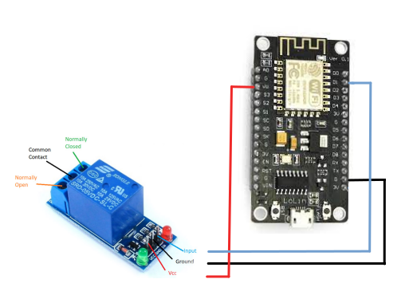
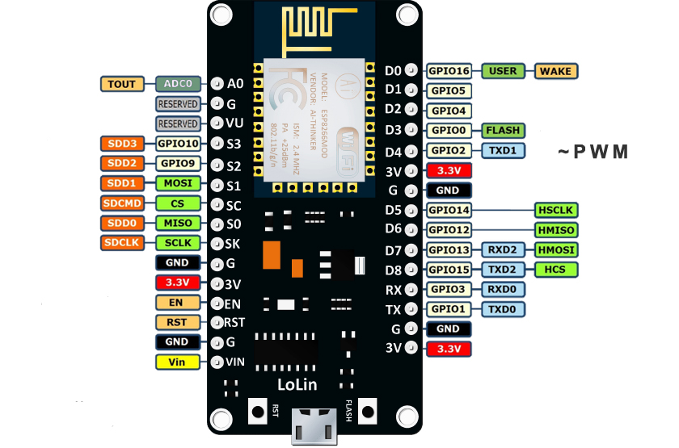
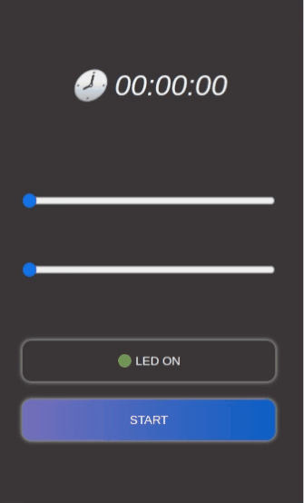

<div align="center">

[](https://code.visualstudio.com/) [![Build with PlatformIO](https://img.shields.io/badge/build%20with-PlatformIO-orange?logo=data%3Aimage%2Fsvg%2Bxml%3Bbase64%2CPHN2ZyB3aWR0aD0iMjUwMCIgaGVpZ2h0PSIyNTAwIiB2aWV3Qm94PSIwIDAgMjU2IDI1NiIgeG1sbnM9Imh0dHA6Ly93d3cudzMub3JnLzIwMDAvc3ZnIiBwcmVzZXJ2ZUFzcGVjdFJhdGlvPSJ4TWlkWU1pZCI+PHBhdGggZD0iTTEyOCAwQzkzLjgxIDAgNjEuNjY2IDEzLjMxNCAzNy40OSAzNy40OSAxMy4zMTQgNjEuNjY2IDAgOTMuODEgMCAxMjhjMCAzNC4xOSAxMy4zMTQgNjYuMzM0IDM3LjQ5IDkwLjUxQzYxLjY2NiAyNDIuNjg2IDkzLjgxIDI1NiAxMjggMjU2YzM0LjE5IDAgNjYuMzM0LTEzLjMxNCA5MC41MS0zNy40OUMyNDIuNjg2IDE5NC4zMzQgMjU2IDE2Mi4xOSAyNTYgMTI4YzAtMzQuMTktMTMuMzE0LTY2LjMzNC0zNy40OS05MC41MUMxOTQuMzM0IDEzLjMxNCAxNjIuMTkgMCAxMjggMCIgZmlsbD0iI0ZGN0YwMCIvPjxwYXRoIGQ9Ik0yNDkuMzg2IDEyOGMwIDY3LjA0LTU0LjM0NyAxMjEuMzg2LTEyMS4zODYgMTIxLjM4NkM2MC45NiAyNDkuMzg2IDYuNjEzIDE5NS4wNCA2LjYxMyAxMjggNi42MTMgNjAuOTYgNjAuOTYgNi42MTQgMTI4IDYuNjE0YzY3LjA0IDAgMTIxLjM4NiA1NC4zNDYgMTIxLjM4NiAxMjEuMzg2IiBmaWxsPSIjRkZGIi8+PHBhdGggZD0iTTE2MC44NjkgNzQuMDYybDUuMTQ1LTE4LjUzN2M1LjI2NC0uNDcgOS4zOTItNC44ODYgOS4zOTItMTAuMjczIDAtNS43LTQuNjItMTAuMzItMTAuMzItMTAuMzJzLTEwLjMyIDQuNjItMTAuMzIgMTAuMzJjMCAzLjc1NSAyLjAxMyA3LjAzIDUuMDEgOC44MzdsLTUuMDUgMTguMTk1Yy0xNC40MzctMy42Ny0yNi42MjUtMy4zOS0yNi42MjUtMy4zOWwtMi4yNTggMS4wMXYxNDAuODcybDIuMjU4Ljc1M2MxMy42MTQgMCA3My4xNzctNDEuMTMzIDczLjMyMy04NS4yNyAwLTMxLjYyNC0yMS4wMjMtNDUuODI1LTQwLjU1NS01Mi4xOTd6TTE0Ni41MyAxNjQuOGMtMTEuNjE3LTE4LjU1Ny02LjcwNi02MS43NTEgMjMuNjQzLTY3LjkyNSA4LjMyLTEuMzMzIDE4LjUwOSA0LjEzNCAyMS41MSAxNi4yNzkgNy41ODIgMjUuNzY2LTM3LjAxNSA2MS44NDUtNDUuMTUzIDUxLjY0NnptMTguMjE2LTM5Ljc1MmE5LjM5OSA5LjM5OSAwIDAgMC05LjM5OSA5LjM5OSA5LjM5OSA5LjM5OSAwIDAgMCA5LjQgOS4zOTkgOS4zOTkgOS4zOTkgMCAwIDAgOS4zOTgtOS40IDkuMzk5IDkuMzk5IDAgMCAwLTkuMzk5LTkuMzk4em0yLjgxIDguNjcyYTIuMzc0IDIuMzc0IDAgMSAxIDAtNC43NDkgMi4zNzQgMi4zNzQgMCAwIDEgMCA0Ljc0OXoiIGZpbGw9IiNFNTcyMDAiLz48cGF0aCBkPSJNMTAxLjM3MSA3Mi43MDlsLTUuMDIzLTE4LjkwMWMyLjg3NC0xLjgzMiA0Ljc4Ni01LjA0IDQuNzg2LTguNzAxIDAtNS43LTQuNjItMTAuMzItMTAuMzItMTAuMzItNS42OTkgMC0xMC4zMTkgNC42Mi0xMC4zMTkgMTAuMzIgMCA1LjY4MiA0LjU5MiAxMC4yODkgMTAuMjY3IDEwLjMxN0w5NS44IDc0LjM3OGMtMTkuNjA5IDYuNTEtNDAuODg1IDIwLjc0Mi00MC44ODUgNTEuODguNDM2IDQ1LjAxIDU5LjU3MiA4NS4yNjcgNzMuMTg2IDg1LjI2N1Y2OC44OTJzLTEyLjI1Mi0uMDYyLTI2LjcyOSAzLjgxN3ptMTAuMzk1IDkyLjA5Yy04LjEzOCAxMC4yLTUyLjczNS0yNS44OC00NS4xNTQtNTEuNjQ1IDMuMDAyLTEyLjE0NSAxMy4xOS0xNy42MTIgMjEuNTExLTE2LjI4IDMwLjM1IDYuMTc1IDM1LjI2IDQ5LjM2OSAyMy42NDMgNjcuOTI2em0tMTguODItMzkuNDZhOS4zOTkgOS4zOTkgMCAwIDAtOS4zOTkgOS4zOTggOS4zOTkgOS4zOTkgMCAwIDAgOS40IDkuNCA5LjM5OSA5LjM5OSAwIDAgMCA5LjM5OC05LjQgOS4zOTkgOS4zOTkgMCAwIDAtOS4zOTktOS4zOTl6bS0yLjgxIDguNjcxYTIuMzc0IDIuMzc0IDAgMSAxIDAtNC43NDggMi4zNzQgMi4zNzQgMCAwIDEgMCA0Ljc0OHoiIGZpbGw9IiNGRjdGMDAiLz48L3N2Zz4=)](https://platformio.org/)

</div>

# 🤖 Projeto

Neste projeto construímos um protótipo de um acionador remoto de fogos de artifício para um de nossos clientes usando o microcontrolador [ESP8266](https://www.espressif.com/en/products/modules/esp8266). O dispositivo cria uma rede Wi-Fi AP ( ponto de acesso ) e desta formas podemos interagir com o dispositivo através de uma interface web usando smartphone, notboook ou PC. A interface web foi construída utilizando o [ReactJS](https://reactjs.org/). O firmware foi programado em C++ usando o editor de texto [Visual Studio Code](https://code.visualstudio.com/) juntamente com a extensão [PlatformIO](https://platformio.org/).

# 🏗️ Materiais Utilizados

1. Módulo microcontrolador ESP8266.

2. Um módulo de relé 3.3v ( Imagem do relé de 5.0v é meramente ilustrativa ).

# 🗺️ Layout

<div align="center">



</div>

<br>

<div align="center">



</div>

# 🚀 Get Started

Instalação das dependências:

```bash
pio lib install
```

A interface web que está no diretório **/data**, deve ser convertida em um arquivo binário e carregada para a memória flash do ESP8266. Abra o terminal integrado do PlatformIO e siga as instruções abaixo:

Primeiramente limpe a memória flash do ESP8266:

```bash
pio run --target erase
```

Em seguida compile a pasta data em um arquivo bínário:

```bash
pio run --target buildfs
```

Carrege o arquivo binário para o ESP8266:

```bash
pio run --target uploadfs
```

Por fim, carregue o binário escrito em C++ para ESP8266:

```bash
pio run --target upload
```

A pasta data foi gerada através do build desta desta [interface web](). Em seguida renomeamos a pasta dist para data e copiamos para o diretório corrente deste projeto.

# 🚀 Como usar

1. Conecte o dispositivo a um Power Bank ou carregador de celular.

2. Se conecte a rede Wi-Fi gerada pelo dispositivo:

```txt
Rede Wi-Fi

Nome: esp8266

Senha: fogos1234
```

2. O SSID e PASSWORD da rede AP pode ser configurado em **_/include/env.h_**.

3. Se seu Smartphone acusar que você esta em uma rede sem internet, informe que deseja continuar conectado a esta rede.

4. Abra o seu navegador, de preferência em uma aba anônima, digite o **1** dos endereços abaixo:

```

Endereço 1 -> http://esp.local

Endereço 2 -> http://192.168.4.1

Endereço 3 -> 192.168.4.1

```

5. O dispositivo abrirá uma pagina web conforme a figura abaixo:

<p  style="text-align:center">



</p>

## **👨‍🚀 Autor**

👋 My contacts!

[](https://www.linkedin.com/in/thiago-pacheco-200a1a86/)
[](mailto:physics.posgrad.@gmail.com)

## **📝 Licença de uso de software**

Este projeto está sob os termos [Apache Licence v2.0](https://www.apache.org/licenses/LICENSE-2.0)
